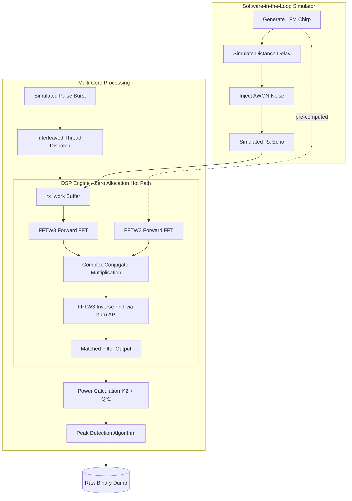

# High-Performance Radar Digital Signal Processing (DSP) Engine

This repository contains a C++20-based Digital Signal Processing engine designed for real-time radar pulse compression and target detection. It features a complete Software-in-the-Loop (SIL) simulation environment and a highly optimized, concurrent DSP core targeting microsecond latency.

## Problem Statement & Motivation

Modern radar systems face a fundamental physics challenge dictated by the radar equation: the energy of an electromagnetic pulse attenuates proportionally to the inverse fourth power of the target distance ($1/R^4$). Consequently, the reflected echo is exceedingly weak, often returning with a Signal-to-Noise Ratio (SNR) far below 0 dB. The target signal is completely submerged in Additive White Gaussian Noise (AWGN) and thermal interference from the receiver hardware.

Furthermore, physical hardware constraints prevent transmitting a pulse that is simultaneously short (for high range resolution) and high-power (to maximize detection range) without causing dielectric breakdown in the transmitter. To circumvent this, systems transmit long Linear Frequency Modulated (LFM) "chirp" pulses. However, this creates a new problem: the received echo is temporally smeared, making it impossible to determine the precise location of the target using simple threshold detection.

This repository implements a high-performance Digital Signal Processing (DSP) solution to this problem known as **Pulse Compression** (or Matched Filtering). By continuously performing mathematical cross-correlation between the known transmitted pulse and the noisy received signal, the smeared echo is compressed into a sharp, narrow peak, effectively pulling the hidden target out of the noise floor.

Because modern Active Electronically Scanned Arrays (AESA) and automotive radar sensors capture millions of samples per second, this complex operation—shifting from the time domain to the frequency domain via Fast Fourier Transforms (FFT)—must be executed under microsecond-level hard real-time deadlines. Failure to process this data stream efficiently results in dropped frames and catastrophic detection latency. This project demonstrates how applying Data-Oriented Design (DoD), cache-friendly memory layouts, and lock-free concurrency in C++20 can fulfill these stringent computational demands.

## Architecture and Execution Flow



## Core Technical Features

### 1. Data-Oriented Design (SoA)
Instead of utilizing standard Object-Oriented paradigms (e.g., `std::vector<std::complex<float>>`), the signal memory architecture is strictly defined as a Structure of Arrays (SoA). The In-phase (I) and Quadrature (Q) components are isolated in contiguous memory blocks. This prevents CPU cache misses during linear iterations and allows direct interaction with SIMD-optimized mathematical libraries without the need for scatter/gather operations.

### 2. Frequency-Domain Matched Filter (Pulse Compression)
Cross-correlation of the received echo and the transmitted pulse is performed in the frequency domain to reduce algorithmic complexity from O(N^2) to O(N log N). The engine leverages the `FFTW3` Guru interface (`fftwf_plan_guru_split_dft`) to perform operations directly on the SoA buffers. An algebraic conjugate inversion is applied to execute the Inverse FFT (IFFT) using the hardware-optimized Forward FFT engines.

### 3. Zero-Allocation Hot Path
To achieve hard real-time execution constraints (measured at ~150us per pulse on a single core), all dynamic memory allocations and FFT hardware plan benchmarking (`FFTW_MEASURE`) are strictly confined to object constructors. The `compress_pulse` hot path operates entirely on pre-allocated state buffers, eliminating heap allocations and locking overhead during active signal processing.

### 4. Lock-Free Concurrency
The engine processes radar bursts concurrently utilizing a standard C++ thread pool. By assigning an independent, pre-initialized `MatchedFilter` object to each physical CPU core, the architecture achieves a completely lock-free parallel execution. Burst pulses are dispatched using an interleaved divide-and-conquer strategy, driving the effective throughput down to ~38us per pulse on an 8-core processor.

### 5. High-Throughput Binary I/O
Processed signal matrices are written to disk using direct memory casting (`reinterpret_cast`) to raw binary format (`.bin`). This bypasses the severe performance bottlenecks of ASCII string formatting, allowing immediate post-processing and visualization via Python/NumPy environments.

## Build Instructions

The project utilizes Modern CMake and relies on `FFTW3`. It is fully compatible with Linux (GCC/Clang) and Windows (MSYS2/MSVC).

### Requirements
- C++20 compliant compiler
- CMake 3.20 or higher
- FFTW3 (Float precision: `fftw3f`)

### Compilation Steps
```bash
# Generate build files (Ninja generator recommended)
cmake -B build

# Compile the executable
cmake --build build

# Run the simulation and DSP engine
./build/app/radar_app
```

## Post-Processing Visualization
The C++ executable dumps the output matrix to `radar_output_0.bin` (32-bit float, little-endian, sequential SoA format). The data can be easily parsed and visualized using NumPy and Matplotlib to inspect the correlation peaks and calculate precise target distance based on the sample index.
